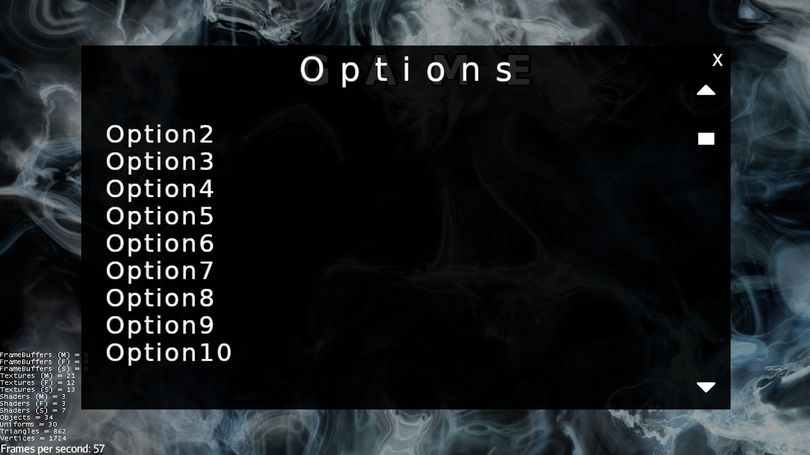
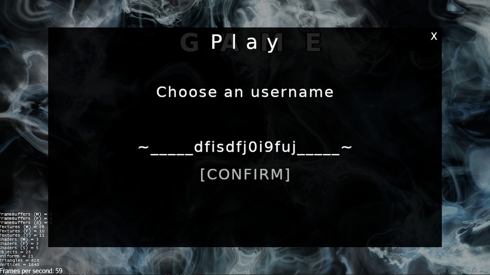
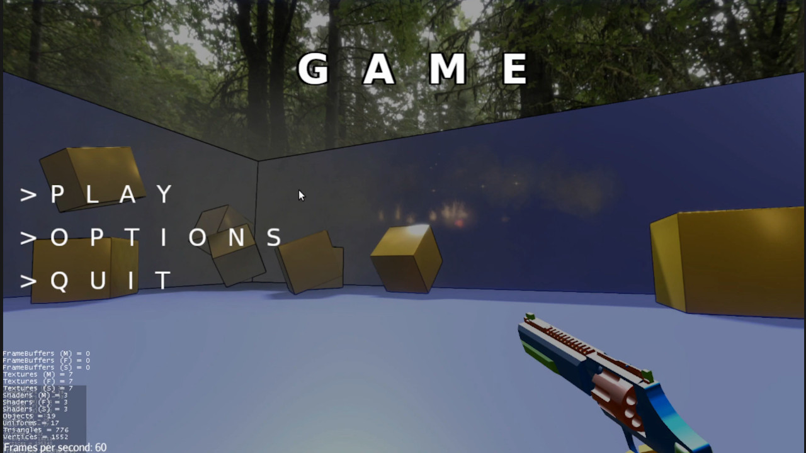

# jme-IGUI

IGUI is a minimalistic immediate gui for [jMonkeyEngine](https://jmonkeyengine.org). It is built around Picture and BitmapText classes.

It can only draw text and images, ~~no input handling whatsoever~~ with very basic input handling and i think i will keep it this way, since this is intended only for very simple usecase (ie. debugging or simple apps) for which more sophisticated ui libraries, such as [Lemur](https://github.com/jMonkeyEngine-Contributions/Lemur) or [Nifty Gui](https://wiki.jmonkeyengine.org/docs/3.3/core/gui/nifty_gui.html), would be overkill.

This is an immediate UI, you don't need to worry about keeping references, updating states etc...  you can just call the methods whenever you want as long as you are inside the update loop, what you define will be rendered for exactly 1 frame. You want to render the exact same thing again in the next frame? Just run the same code again.

If something really never changes for a long time, you can use the image() and text() methods that accept a `boolean persistent` arg. In this case the generated component will live forever until you call `.destroy()` on it.

That's all. Usage example in [src/test/java/IGuiTest.java](src/test/java/IGuiTest.java).


## Jitpack coordinates

```gradle
plugins {
    id "io.github.0ffz.github-packages" version "1.2.1"
}

repositories {
    maven githubPackage.invoke("riccardobl")
}

dependencies {
    implementation 'wf.frk:jme-igui:$VERSION'
}
```

--------






